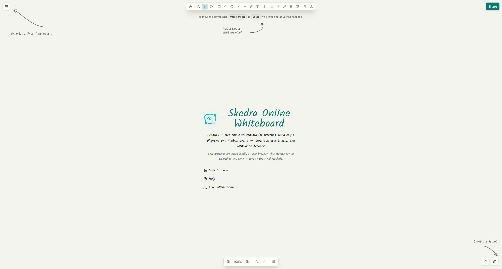

<p align="center">
  <a href="https://skedra.xyz">
    <picture>
      <source media="(prefers-color-scheme: dark)" srcset="apps/web/public/logo-wordmark-dark.png" />
      
    </picture>
  </a>
</p>

<p align="center">
  <a href="https://skedra.xyz">Whiteboard</a> ·
  <a href="https://libraries.skedra.xyz">Libraries</a> ·
  <a href="#self-host-skedra">Self-host</a> ·
  <a href="packages/react">React SDK</a>
</p>

<h2 align="center">An open-source visual workspace for ideas, diagrams, and teamwork.</h2>

<p align="center">
  Local-first. Collaborative. Self-hostable.
</p>

<p align="center">
  <a href="https://github.com/moonriddim/skedra-community/actions/workflows/docker-images.yml">
    
  </a>
  <a href="LICENSE">
    
  </a>
  <a href="https://github.com/moonriddim/skedra-community/pkgs/container/skedra-community-standalone">
    
  </a>
</p>

Skedra is a modern infinite canvas for sketching ideas, mapping systems, planning
projects, and collaborating with a team. Use the free whiteboard at
[skedra.xyz](https://skedra.xyz), or run the complete Community edition on your
own infrastructure.

<p align="center">
  <a href="https://skedra.xyz">
    
  </a>
</p>

## Features

- **Infinite canvas** with shapes, text, arrows, freehand drawing, images, and frames
- **Visual workflows** for flowcharts, mind maps, kanban boards, and reusable templates
- **Local-first whiteboard** that works without creating an account
- **Real-time collaboration** with encrypted canvas updates and assets
- **Team workspaces** with roles, permissions, comments, mentions, and activity
- **Shareable boards** for guests, presentations, and read-only embeds
- **Shape libraries** with `.skedralib` import, private collections, and a community catalog
- **Portable files** with the open `.skedra` format
- **Optional AI and voice calls** using your own providers
- **Dark mode and localization** for a comfortable workspace

## Skedra Community

Skedra Community is the complete open-source workspace: the web app, accounts,
teams, persisted boards, collaboration, comments, libraries, API, database, and
self-hosting tools.

The canvas is also available as reusable, auth-free packages:

- [`@skedra/canvas-core`](packages/canvas-core) — canvas model and algorithms
- [`@skedra/react`](packages/react) — embeddable React editor

See [Community scope](PRODUCT_BOUNDARY.md) for the exact project boundary.

## Self-host Skedra

The fastest way to run Skedra is the all-in-one Docker image:

```bash
docker run -d \
  --name skedra \
  -p 3000:80 \
  -v skedra_data:/data \
  ghcr.io/moonriddim/skedra-community-standalone:latest
```

Open [http://localhost:3000](http://localhost:3000). Your boards, database, and
instance secrets are kept in the `skedra_data` volume.

For Docker Compose, production domains, external storage, LiveKit, updates, and
backups, follow the [self-hosting guide](SELFHOST.md).

## Development

```bash
git clone https://github.com/moonriddim/skedra-community.git
cd skedra-community
docker compose -f docker-compose.dev.yml up -d
cp .env.example .env
pnpm install
pnpm db:push
pnpm dev
```

Open [http://localhost:5174](http://localhost:5174).

## Contributing

Skedra is built in the open, and contributions are welcome.

- Found a bug or have an idea? [Open an issue](https://github.com/moonriddim/skedra-community/issues).
- Want to improve the code? Fork the repository and open a pull request.
- Planning a larger change? Start with an issue so we can align on the direction.

## License

Skedra Community is licensed under [`AGPL-3.0-only`](LICENSE). The reusable
[`canvas-core`](packages/canvas-core/LICENSE) and
[`react`](packages/react/LICENSE) packages are available under the MIT License.
