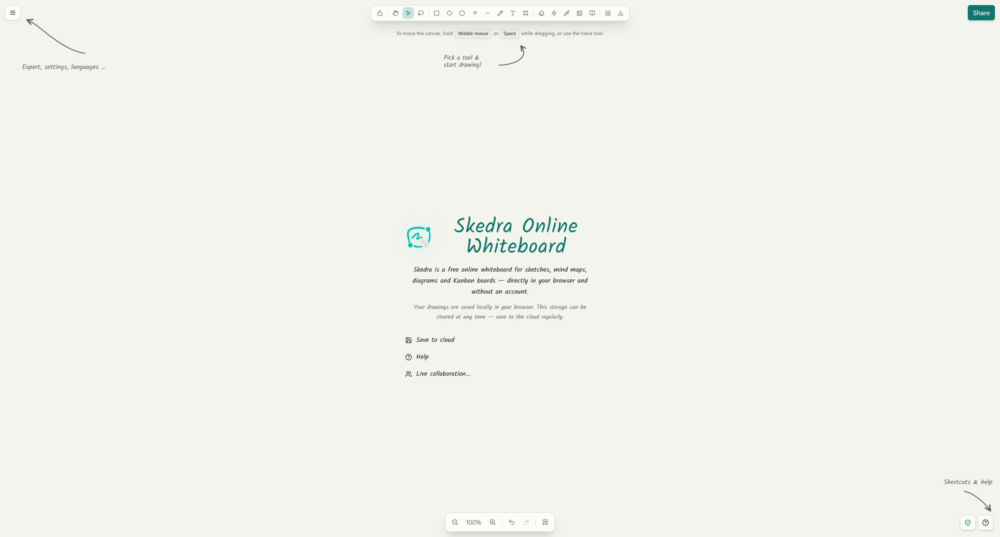

<p align="center">
  <a href="https://skedra.xyz">
    <picture>
      <source media="(prefers-color-scheme: dark)" srcset="apps/web/public/logo-wordmark-dark.png" />
      
    </picture>
  </a>
</p>

<p align="center">
  <a href="https://skedra.xyz">Whiteboard</a> ·
  <a href="https://skedra.xyz/mcp">MCP for AI agents</a> ·
  <a href="https://libraries.skedra.xyz">Libraries</a> ·
  <a href="https://discord.gg/7BqMSy5dy">Discord</a> ·
  <a href="#self-host-skedra">Self-host</a> ·
  <a href="packages/react">React SDK</a>
</p>

<h2 align="center">Skedra Whiteboard — the source-available visual workspace for people and AI agents.</h2>

<p align="center">
  Local-first. Agent-editable. Collaborative. Self-hostable.
</p>

<p align="center">
  <a href="https://github.com/moonriddim/skedra-community/actions/workflows/docker-images.yml">
    
  </a>
  <a href="LICENSE">
    
  </a>
  <a href="https://github.com/moonriddim/skedra-community/pkgs/container/skedra-community-standalone">
    
  </a>
</p>

Skedra Whiteboard is a modern infinite canvas for sketching ideas, mapping systems, planning
projects, and collaborating with people or AI agents. Through its 23-tool MCP server,
agents can create and edit native Kanban boards, Gantt timelines and diagrams instead
of returning flat screenshots. Use the free whiteboard at
[skedra.xyz](https://skedra.xyz), or run the complete Community edition on your
own infrastructure.

<p align="center">
  <a href="https://skedra.xyz">
    
  </a>
</p>

## Features

- **Infinite canvas** with shapes, text, arrows, freehand drawing, images, and frames
- **Visual workflows** for flowcharts, mind maps, graphical sequence diagrams with optional Mermaid import, Gantt charts, kanban boards, and reusable templates
- **Local-first whiteboard** that works without creating an account
- **Real-time collaboration** with encrypted canvas updates and assets
- **Team workspaces** with roles, permissions, comments, mentions, and activity
- **Shareable boards** for guests, presentations, and read-only embeds
- **MCP server** with 23 structured tools for agent-editable boards, plans, diagrams, members, and activity
- **Shape libraries** with `.skedralib` import, private collections, and a community catalog
- **Portable files** with the open `.skedra` format
- **Optional AI and voice calls** using your own providers
- **Dark mode and localization** for a comfortable workspace

## MCP for AI agents

Connect Codex, Claude, Cursor, OpenCode or another Streamable HTTP client to
the hosted server:

```text
https://skedra.xyz/api/mcp
```

Create an account, then open **Settings > API Keys & MCP** for a generated,
client-specific configuration. New Founding Users receive 30 days of Skedra
Cloud access without a credit card.

The result of an agent call is a normal editable Skedra board. Humans can keep
moving cards, changing dependencies and refining diagrams while the agent reads
and updates the same structured elements.

- [MCP product page and demo](https://skedra.xyz/mcp)
- [MCP setup, security boundary and example prompts](docs/MCP.md)
- [Official MCP Registry submission package](apps/mcp/REGISTRY.md)

## Skedra Community

Skedra Community is the complete source-available workspace: the web app, accounts,
teams, persisted boards, collaboration, comments, libraries, API, database, and
self-hosting tools.

The canvas is also available as reusable, auth-free packages:

- [`@skedra/canvas-core`](packages/canvas-core) — canvas model and algorithms
- [`@skedra/canvas-editor`](packages/canvas-editor) — shared editor interactions
- [`@skedra/canvas-react`](packages/canvas-react) — shared SVG renderer
- [`@skedra/react`](packages/react) — embeddable React editor

See [Community scope](PRODUCT_BOUNDARY.md) for the exact project boundary.

## Self-host Skedra

The fastest way to run Skedra is the all-in-one Docker image:

```bash
docker run -d \
  --name skedra \
  -p 3000:80 \
  -v skedra_data:/data \
  -e SKEDRA_OBJECT_STORAGE_PROVIDER=filesystem \
  ghcr.io/moonriddim/skedra-community-standalone:latest
```

Open [http://localhost:3000](http://localhost:3000). Your database, uploaded files,
and instance secrets are kept in the `skedra_data` volume. New uploads are stored
separately from PostgreSQL in `/data/assets`; you can also mount a TrueNAS dataset
or VPS directory, or configure S3-compatible storage.

For Docker Compose, production domains, external storage, LiveKit, updates, and
backups, follow the [self-hosting guide](SELFHOST.md).

## Development

```bash
git clone https://github.com/moonriddim/skedra-community.git
cd skedra-community
docker compose -f docker-compose.dev.yml up -d
cp .env.example .env
pnpm install
pnpm db:push
pnpm dev
```

Open [http://localhost:5174](http://localhost:5174).

`pnpm dev` also keeps the public React SDK artifacts current while shared
canvas code changes. Use `pnpm dev:sdk` for the SDK watcher alone and
`pnpm sdk:verify` to run the focused Web/SDK parity, package, and build checks.

## Contributing

Skedra is developed publicly, and contributions are welcome. Please read
[CONTRIBUTING.md](CONTRIBUTING.md), including the license terms for submitted work.

- Found a bug or have an idea? [Open an issue](https://github.com/moonriddim/skedra-community/issues).
- Need help or want to share what you are building? [Join the Skedra Discord](https://discord.gg/7BqMSy5dy).
- Want to improve the code? Fork the repository and open a pull request.
- Planning a larger change? Start with an issue so we can align on the direction.

## License

Skedra Community, including all Skedra-owned SDK, editor, canvas, and deployment
code, uses the [Skedra Community License 1.0](LICENSE).

Self-hosting for personal and internal business use, code changes, development
forks, and pull requests are welcome. Independent products, rebranding, and
third-party hosted services (free or paid) require a separate written license.
This is source-available software, not Open Source software. Earlier AGPL/MIT
grants and third-party licenses remain unaffected.

See [licensing examples and transition details](LICENSING.md) and
[contribution terms](CONTRIBUTING.md).
